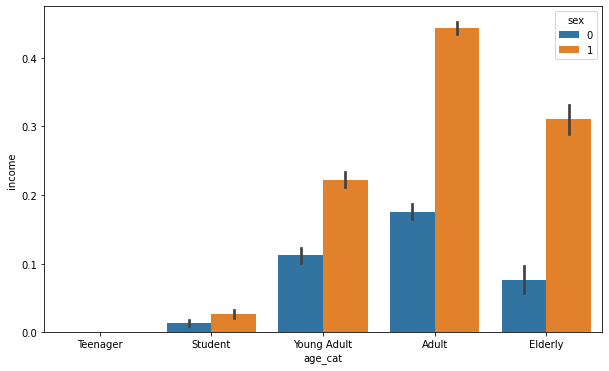
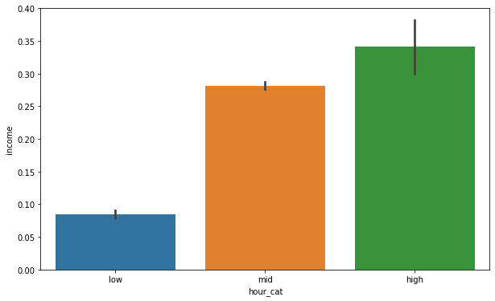
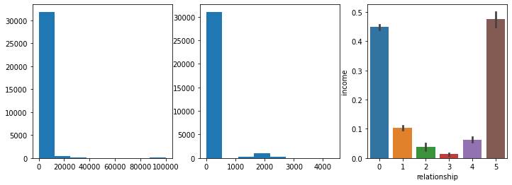
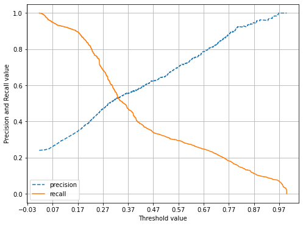
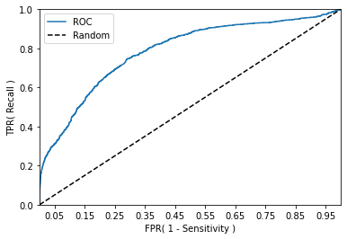
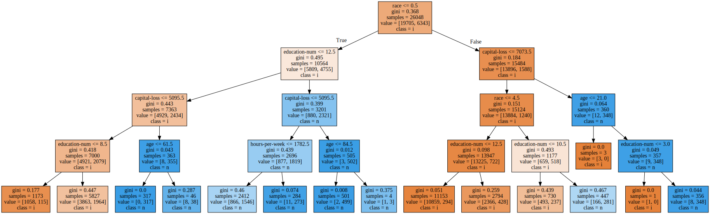

# 3조 강소현(조장),이주경,공길정,강승훈


```python
import numpy as np
import pandas as pd
import matplotlib.pyplot as plt
import seaborn as sns
%matplotlib inline
names=['age','workclass', 'fnlwgt', 'education', 'education-num', 'marital-status', 'occupation', 'relationship', 'race', 'sex', 'capital-gain', 'capital-loss', 'hours-per-week', 'native-country','income']

adult_df = pd.read_csv('adult.csv',names = names)
adult_df.head(5)
```


<div>
<style scoped>
    .dataframe tbody tr th:only-of-type {
        vertical-align: middle;
    }

    .dataframe tbody tr th {
        vertical-align: top;
    }
    
    .dataframe thead th {
        text-align: right;
    }
</style>
<table border="1" class="dataframe">
  <thead>
    <tr style="text-align: right;">
      <th></th>
      <th>age</th>
      <th>workclass</th>
      <th>fnlwgt</th>
      <th>education</th>
      <th>education-num</th>
      <th>marital-status</th>
      <th>occupation</th>
      <th>relationship</th>
      <th>race</th>
      <th>sex</th>
      <th>capital-gain</th>
      <th>capital-loss</th>
      <th>hours-per-week</th>
      <th>native-country</th>
      <th>income</th>
    </tr>
  </thead>
  <tbody>
    <tr>
      <th>0</th>
      <td>39</td>
      <td>State-gov</td>
      <td>77516</td>
      <td>Bachelors</td>
      <td>13</td>
      <td>Never-married</td>
      <td>Adm-clerical</td>
      <td>Not-in-family</td>
      <td>White</td>
      <td>Male</td>
      <td>2174</td>
      <td>0</td>
      <td>40</td>
      <td>United-States</td>
      <td>&lt;=50K</td>
    </tr>
    <tr>
      <th>1</th>
      <td>50</td>
      <td>Self-emp-not-inc</td>
      <td>83311</td>
      <td>Bachelors</td>
      <td>13</td>
      <td>Married-civ-spouse</td>
      <td>Exec-managerial</td>
      <td>Husband</td>
      <td>White</td>
      <td>Male</td>
      <td>0</td>
      <td>0</td>
      <td>13</td>
      <td>United-States</td>
      <td>&lt;=50K</td>
    </tr>
    <tr>
      <th>2</th>
      <td>38</td>
      <td>Private</td>
      <td>215646</td>
      <td>HS-grad</td>
      <td>9</td>
      <td>Divorced</td>
      <td>Handlers-cleaners</td>
      <td>Not-in-family</td>
      <td>White</td>
      <td>Male</td>
      <td>0</td>
      <td>0</td>
      <td>40</td>
      <td>United-States</td>
      <td>&lt;=50K</td>
    </tr>
    <tr>
      <th>3</th>
      <td>53</td>
      <td>Private</td>
      <td>234721</td>
      <td>11th</td>
      <td>7</td>
      <td>Married-civ-spouse</td>
      <td>Handlers-cleaners</td>
      <td>Husband</td>
      <td>Black</td>
      <td>Male</td>
      <td>0</td>
      <td>0</td>
      <td>40</td>
      <td>United-States</td>
      <td>&lt;=50K</td>
    </tr>
    <tr>
      <th>4</th>
      <td>28</td>
      <td>Private</td>
      <td>338409</td>
      <td>Bachelors</td>
      <td>13</td>
      <td>Married-civ-spouse</td>
      <td>Prof-specialty</td>
      <td>Wife</td>
      <td>Black</td>
      <td>Female</td>
      <td>0</td>
      <td>0</td>
      <td>40</td>
      <td>Cuba</td>
      <td>&lt;=50K</td>
    </tr>
  </tbody>
</table>
</div>


```python
### 데이터 null값 파악 ###
print('** adult 정보 ** \n')
print(adult_df.info())
```

    ** adult 정보 ** 
    
    <class 'pandas.core.frame.DataFrame'>
    RangeIndex: 32561 entries, 0 to 32560
    Data columns (total 15 columns):
     #   Column          Non-Null Count  Dtype 
    ---  ------          --------------  ----- 
     0   age             32561 non-null  int64 
     1   workclass       32561 non-null  object
     2   fnlwgt          32561 non-null  int64 
     3   education       32561 non-null  object
     4   education-num   32561 non-null  int64 
     5   marital-status  32561 non-null  object
     6   occupation      32561 non-null  object
     7   relationship    32561 non-null  object
     8   race            32561 non-null  object
     9   sex             32561 non-null  object
     10  capital-gain    32561 non-null  int64 
     11  capital-loss    32561 non-null  int64 
     12  hours-per-week  32561 non-null  int64 
     13  native-country  32561 non-null  object
     14  income          32561 non-null  object
    dtypes: int64(6), object(9)
    memory usage: 3.7+ MB
    None


```python
print('**성별** \n',adult_df['sex'].value_counts())
print('\n**인종** \n',adult_df['race'].value_counts())
print('\n**수입** \n',adult_df['income'].value_counts())
print('\n**나라** \n',adult_df['native-country'].value_counts())
```

    **성별** 
      Male      21790
     Female    10771
    Name: sex, dtype: int64
    
    **인종** 
      White                 27816
     Black                  3124
     Asian-Pac-Islander     1039
     Amer-Indian-Eskimo      311
     Other                   271
    Name: race, dtype: int64
    
    **수입** 
      <=50K    24720
     >50K      7841
    Name: income, dtype: int64
    
    **나라** 
      United-States                 29170
     Mexico                          643
     ?                               583
     Philippines                     198
     Germany                         137
     Canada                          121
     Puerto-Rico                     114
     El-Salvador                     106
     India                           100
     Cuba                             95
     England                          90
     Jamaica                          81
     South                            80
     China                            75
     Italy                            73
     Dominican-Republic               70
     Vietnam                          67
     Guatemala                        64
     Japan                            62
     Poland                           60
     Columbia                         59
     Taiwan                           51
     Haiti                            44
     Iran                             43
     Portugal                         37
     Nicaragua                        34
     Peru                             31
     France                           29
     Greece                           29
     Ecuador                          28
     Ireland                          24
     Hong                             20
     Cambodia                         19
     Trinadad&Tobago                  19
     Thailand                         18
     Laos                             18
     Yugoslavia                       16
     Outlying-US(Guam-USVI-etc)       14
     Honduras                         13
     Hungary                          13
     Scotland                         12
     Holand-Netherlands                1
    Name: native-country, dtype: int64


```python
### 국가 앞글자만 자름 ###
adult_df['native-country'] = adult_df['native-country'].str[1:2]
print(adult_df['native-country'].head(6))
```

    0    U
    1    U
    2    U
    3    U
    4    C
    5    U
    Name: native-country, dtype: object


```python
### 성별-수입 ###
adult_df.groupby(['sex','income'])['income'].count()
```


    sex      income
     Female   <=50K     9592
              >50K      1179
     Male     <=50K    15128
              >50K      6662
    Name: income, dtype: int64


```python
### 인종-수입 ###
adult_df.groupby(['race','income'])['income'].count()
```


    race                 income
     Amer-Indian-Eskimo   <=50K      275
                          >50K        36
     Asian-Pac-Islander   <=50K      763
                          >50K       276
     Black                <=50K     2737
                          >50K       387
     Other                <=50K      246
                          >50K        25
     White                <=50K    20699
                          >50K      7117
    Name: income, dtype: int64


```python
### 필요없다고 판단되는 것 drop ###
adult_df.drop(['workclass','education','fnlwgt','marital-status'],axis=1,inplace=True)
```


```python
from sklearn.preprocessing import LabelEncoder
# 레이블 인코딩 수행. 
    
names = ['race','sex','occupation','native-country','income','relationship']
for n in names:
    le = LabelEncoder()
    le = le.fit(adult_df[n])
    adult_df[n] = le.transform(adult_df[n])

adult_df.head()
```


<div>
<style scoped>
    .dataframe tbody tr th:only-of-type {
        vertical-align: middle;
    }

    .dataframe tbody tr th {
        vertical-align: top;
    }
    
    .dataframe thead th {
        text-align: right;
    }
</style>
<table border="1" class="dataframe">
  <thead>
    <tr style="text-align: right;">
      <th></th>
      <th>age</th>
      <th>education-num</th>
      <th>occupation</th>
      <th>relationship</th>
      <th>race</th>
      <th>sex</th>
      <th>capital-gain</th>
      <th>capital-loss</th>
      <th>hours-per-week</th>
      <th>native-country</th>
      <th>income</th>
    </tr>
  </thead>
  <tbody>
    <tr>
      <th>0</th>
      <td>39</td>
      <td>13</td>
      <td>1</td>
      <td>1</td>
      <td>4</td>
      <td>1</td>
      <td>2174</td>
      <td>0</td>
      <td>40</td>
      <td>16</td>
      <td>0</td>
    </tr>
    <tr>
      <th>1</th>
      <td>50</td>
      <td>13</td>
      <td>4</td>
      <td>0</td>
      <td>4</td>
      <td>1</td>
      <td>0</td>
      <td>0</td>
      <td>13</td>
      <td>16</td>
      <td>0</td>
    </tr>
    <tr>
      <th>2</th>
      <td>38</td>
      <td>9</td>
      <td>6</td>
      <td>1</td>
      <td>4</td>
      <td>1</td>
      <td>0</td>
      <td>0</td>
      <td>40</td>
      <td>16</td>
      <td>0</td>
    </tr>
    <tr>
      <th>3</th>
      <td>53</td>
      <td>7</td>
      <td>6</td>
      <td>0</td>
      <td>2</td>
      <td>1</td>
      <td>0</td>
      <td>0</td>
      <td>40</td>
      <td>16</td>
      <td>0</td>
    </tr>
    <tr>
      <th>4</th>
      <td>28</td>
      <td>13</td>
      <td>10</td>
      <td>5</td>
      <td>2</td>
      <td>0</td>
      <td>0</td>
      <td>0</td>
      <td>40</td>
      <td>1</td>
      <td>0</td>
    </tr>
  </tbody>
</table>
</div>


```python
### 인코딩 후 확인 ###
print(adult_df.info())
```

    <class 'pandas.core.frame.DataFrame'>
    RangeIndex: 32561 entries, 0 to 32560
    Data columns (total 11 columns):
     #   Column          Non-Null Count  Dtype
    ---  ------          --------------  -----
     0   age             32561 non-null  int64
     1   education-num   32561 non-null  int64
     2   occupation      32561 non-null  int32
     3   relationship    32561 non-null  int32
     4   race            32561 non-null  int32
     5   sex             32561 non-null  int32
     6   capital-gain    32561 non-null  int64
     7   capital-loss    32561 non-null  int64
     8   hours-per-week  32561 non-null  int64
     9   native-country  32561 non-null  int32
     10  income          32561 non-null  int32
    dtypes: int32(6), int64(5)
    memory usage: 2.0 MB
    None


```python
def get_category(age):
    cat = ''
    if age <= 18: cat = 'Teenager'
    elif age <= 25: cat = 'Student'
    elif age <= 35: cat = 'Young Adult'
    elif age <= 60: cat = 'Adult'
    else : cat = 'Elderly'
    
    return cat

# 막대그래프의 크기 figure를 더 크게 설정 
plt.figure(figsize=(10,6))

#X축의 값을 순차적으로 표시하기 위한 설정 
group_names = ['Teenager', 'Student', 'Young Adult', 'Adult', 'Elderly']

# lambda 식에 위에서 생성한 get_category( ) 함수를 반환값으로 지정. 
# get_category(X)는 입력값으로 'Age' 컬럼값을 받아서 해당하는 cat 반환
adult_df['age_cat'] = adult_df['age'].apply(lambda x : get_category(x))
sns.barplot(x='age_cat', y = 'income', hue='sex', data=adult_df, order=group_names)
adult_df.drop('age_cat', axis=1, inplace=True)
```


​    

​    


```python
def hour_category(hours_per_week):
    cat = ''
    if hours_per_week<=35: cat = 'low'
    elif hours_per_week<= 70: cat = 'mid'
    else : cat= 'high'
    
    return cat

# 막대그래프의 크기 figure를 더 크게 설정 
plt.figure(figsize=(10,6))

#X축의 값을 순차적으로 표시하기 위한 설정 
group_names = ['low','mid','high']

# lambda 식에 위에서 생성한 get_category( ) 함수를 반환값으로 지정. 
# get_category(X)는 입력값으로 'Age' 컬럼값을 받아서 해당하는 cat 반환
adult_df['hour_cat'] = adult_df['hours-per-week'].apply(lambda x : hour_category(x))
sns.barplot(x='hour_cat', y = 'income', data=adult_df, order=group_names)
adult_df.drop('hour_cat', axis=1, inplace=True)
```


​    

​    


```python
plt.figure(figsize=[12,4])
plt.subplot(131)
sns.barplot(x='occupation', y = 'income', data=adult_df)
plt.subplot(132)
sns.barplot(x='race', y = 'income', data=adult_df)
plt.subplot(133)
sns.barplot(x='education-num', y = 'income', data=adult_df)
```


    <AxesSubplot:xlabel='education-num', ylabel='income'>


​    

​    


```python
plt.figure(figsize=[12,4])
plt.subplot(131)
plt.hist(adult_df['capital-gain'], bins=8)
plt.subplot(132)
plt.hist(adult_df['capital-loss'], bins=8)
plt.subplot(133)
sns.barplot(x='relationship', y = 'income', data=adult_df)
```


    <AxesSubplot:xlabel='relationship', ylabel='income'>


​    

​    


```python
zero_features = ['capital-gain','capital-loss']

# 전체 데이터 건수
total_count = adult_df['capital-gain'].count()

# 피처별로 반복 하면서 데이터 값이 0 인 데이터 건수 추출하고, 퍼센트 계산
for feature in zero_features:
    zero_count =adult_df[adult_df[feature] == 0][feature].count()
    print('{0} 0 건수는 {1}, 퍼센트는 {2:.2f} %'.format(feature, zero_count, 100*zero_count/total_count))
```

    capital-gain 0 건수는 29849, 퍼센트는 91.67 %
    capital-loss 0 건수는 31042, 퍼센트는 95.33 %


```python
# 인덱싱으로 age 컬럼부터 연속해서 native-country 까지의 열을 가져올 수 있음.
X=adult_df.loc[:,'age':'native-country']
y=adult_df.loc[:,'income']
```

## 평가지표

#### 오차행렬, 정확도, 정밀도, 재현율


```python
from sklearn.model_selection import train_test_split
X_train, X_test, y_train, y_test = train_test_split(X, y, random_state=0)
```


```python
from sklearn.metrics import confusion_matrix, accuracy_score
from sklearn.metrics import precision_score, recall_score
from sklearn.metrics import f1_score, roc_auc_score

# 배웠던 평가지표를 구현하는 함수
def get_clf_eval(y_test , pred):
    confusion = confusion_matrix( y_test, pred)
    accuracy = accuracy_score(y_test , pred)
    precision = precision_score(y_test , pred)
    recall = recall_score(y_test , pred)
    f1 = f1_score(y_test,pred)
    roc_auc = roc_auc_score(y_test, pred)
    print('오차 행렬')
    print(confusion)
    print('정확도: {0:.4f}, 정밀도: {1:.4f}, 재현율: {2:.4f},\
    F1: {3:.4f}, AUC:{4:.4f}'.format(accuracy, precision, recall, f1, roc_auc))
```


```python
# KNN
from sklearn.neighbors import KNeighborsClassifier
clf = KNeighborsClassifier(n_neighbors=13)
clf.fit(X_train, y_train)
print("훈련 세트 정확도: {:.3f}".format(clf.score(X_train, y_train)))
print("테스트 세트 정확도: {:.3f}".format(clf.score(X_test, y_test)))
print()
pred=clf.predict(X_test)
get_clf_eval(y_test , pred)
```

    훈련 세트 정확도: 0.864
    테스트 세트 정확도: 0.838
    
    오차 행렬
    [[5724  435]
     [ 885 1097]]
    정확도: 0.8379, 정밀도: 0.7161, 재현율: 0.5535,    F1: 0.6244, AUC:0.7414


```python
from sklearn.model_selection import train_test_split
from sklearn.metrics import accuracy_score, precision_score, recall_score, roc_auc_score
from sklearn.metrics import f1_score, confusion_matrix, precision_recall_curve, roc_curve
from sklearn.preprocessing import StandardScaler
from sklearn.linear_model import LogisticRegression

def precision_recall_curve_plot(y_test=None, pred_proba_c1=None):
    # threshold ndarray와 이 threshold에 따른 정밀도, 재현율 ndarray 추출. 
    precisions, recalls, thresholds = precision_recall_curve( y_test, pred_proba_c1)
    
    # X축을 threshold값으로, Y축은 정밀도, 재현율 값으로 각각 Plot 수행. 정밀도는 점선으로 표시
    plt.figure(figsize=(8,6))
    threshold_boundary = thresholds.shape[0]
    plt.plot(thresholds, precisions[0:threshold_boundary], linestyle='--', label='precision')
    plt.plot(thresholds, recalls[0:threshold_boundary],label='recall')
    
    # threshold 값 X 축의 Scale을 0.1 단위로 변경
    start, end = plt.xlim()
    plt.xticks(np.round(np.arange(start, end, 0.1),2))
    
    # x축, y축 label과 legend, 그리고 grid 설정
    plt.xlabel('Threshold value'); plt.ylabel('Precision and Recall value')
    plt.legend(); plt.grid()
    plt.show()
```


```python
# 피처 데이터 세트 X, 레이블 데이터 세트 y를 추출. 
# 맨 끝이 Outcome 컬럼으로 레이블 값임. 컬럼 위치 -1을 이용해 추출 
X = adult_df.iloc[:, :-1]
y = adult_df.iloc[:, -1]

X_train, X_test, y_train, y_test = train_test_split(X, y, test_size = 0.2, random_state = 156, stratify=y)

# 로지스틱 회귀로 학습,예측 및 평가 수행. 
lr_clf = LogisticRegression()
lr_clf.fit(X_train , y_train)
pred = lr_clf.predict(X_test)

get_clf_eval(y_test, pred)
```

    오차 행렬
    [[4662  283]
     [1058  510]]
    정확도: 0.7941, 정밀도: 0.6431, 재현율: 0.3253,    F1: 0.4320, AUC:0.6340


    c:\users\ad\appdata\local\programs\python\python38\lib\site-packages\sklearn\linear_model\_logistic.py:763: ConvergenceWarning: lbfgs failed to converge (status=1):
    STOP: TOTAL NO. of ITERATIONS REACHED LIMIT.
    
    Increase the number of iterations (max_iter) or scale the data as shown in:
        https://scikit-learn.org/stable/modules/preprocessing.html
    Please also refer to the documentation for alternative solver options:
        https://scikit-learn.org/stable/modules/linear_model.html#logistic-regression
      n_iter_i = _check_optimize_result(


#### 임계값의 변경에 따른 정밀도-재현율 변화 곡선을 그림


```python
pred_proba_c1 = lr_clf.predict_proba(X_test)[:, 1]
precision_recall_curve_plot(y_test, pred_proba_c1)
```


​    

​    


#### 임계값에 따른 정확도, 정밀도, 재현율, F1, AUC 


```python
from sklearn.preprocessing import Binarizer

def get_eval_by_threshold(y_test , pred_proba_c1, thresholds):
    # thresholds 리스트 객체내의 값을 차례로 iteration하면서 Evaluation 수행.
    for custom_threshold in thresholds:
        binarizer = Binarizer(threshold=custom_threshold).fit(pred_proba_c1) 
        custom_predict = binarizer.transform(pred_proba_c1)
        print('임계값:',custom_threshold)
        get_clf_eval(y_test , custom_predict)
        
thresholds = [0.25 , 0.3 , 0.35, 0.4]
pred_proba = lr_clf.predict_proba(X_test)
get_eval_by_threshold(y_test, pred_proba[:,1].reshape(-1,1), thresholds )
```

    임계값: 0.25
    오차 행렬
    [[3466 1479]
     [ 392 1176]]
    정확도: 0.7127, 정밀도: 0.4429, 재현율: 0.7500,    F1: 0.5570, AUC:0.7255
    임계값: 0.3
    오차 행렬
    [[4016  929]
     [ 615  953]]
    정확도: 0.7629, 정밀도: 0.5064, 재현율: 0.6078,    F1: 0.5525, AUC:0.7100
    임계값: 0.35
    오차 행렬
    [[4287  658]
     [ 780  788]]
    정확도: 0.7792, 정밀도: 0.5450, 재현율: 0.5026,    F1: 0.5229, AUC:0.6847
    임계값: 0.4
    오차 행렬
    [[4457  488]
     [ 911  657]]
    정확도: 0.7852, 정밀도: 0.5738, 재현율: 0.4190,    F1: 0.4843, AUC:0.6602


```python
binarizer = Binarizer(threshold=0.35)

# 위에서 구한 lr_clf의 predict_proba() 예측 확률 array에서 1에 해당하는 컬럼값을 Binarizer변환. 
pred_th_048 = binarizer.fit_transform(pred_proba[:, 1].reshape(-1,1)) 

get_clf_eval(y_test , pred_th_048)
```

    오차 행렬
    [[4287  658]
     [ 780  788]]
    정확도: 0.7792, 정밀도: 0.5450, 재현율: 0.5026,    F1: 0.5229, AUC:0.6847


#### ROC AUC


```python
def roc_curve_plot(y_test , pred_proba_c1):
    # 임곗값에 따른 FPR, TPR 값을 반환 받음. 
    fprs , tprs , thresholds = roc_curve(y_test ,pred_proba_c1)

    # ROC Curve를 plot 곡선으로 그림. 
    plt.plot(fprs , tprs, label='ROC')
    # 가운데 대각선 직선을 그림. 
    plt.plot([0, 1], [0, 1], 'k--', label='Random')
    
    # FPR X 축의 Scale을 0.1 단위로 변경, X,Y 축명 설정등   
    start, end = plt.xlim()
    plt.xticks(np.round(np.arange(start, end, 0.1),2))
    plt.xlim(0,1); plt.ylim(0,1)
    plt.xlabel('FPR( 1 - Sensitivity )'); plt.ylabel('TPR( Recall )')
    plt.legend()
    plt.show()
    
roc_curve_plot(y_test,lr_clf.predict_proba(X_test)[:, 1] )
```


​    

​    


## 분류기

#### Random Forest


```python
import pandas as pd

from sklearn.ensemble import RandomForestClassifier
from sklearn.metrics import accuracy_score
import pandas as pd
import warnings
warnings.filterwarnings('ignore')

# 랜덤 포레스트 학습 및 별도의 테스트 셋으로 예측 성능 평가
rf_clf = RandomForestClassifier(random_state=0)
rf_clf.fit(X_train , y_train)
pred = rf_clf.predict(X_test)
accuracy = accuracy_score(y_test , pred)
print('랜덤 포레스트 정확도: {0:.4f}'.format(accuracy))
```

    랜덤 포레스트 정확도: 0.8449


```python
from sklearn.model_selection import GridSearchCV

params = {
    'n_estimators':[100],
    'max_depth' : [6, 8, 10, 12], 
    'min_samples_leaf' : [8, 12, 18 ],
    'min_samples_split' : [8, 16, 20]
}
# RandomForestClassifier 객체 생성 후 GridSearchCV 수행
rf_clf = RandomForestClassifier(random_state=0, n_jobs=-1)
grid_cv = GridSearchCV(rf_clf , param_grid=params , cv=2, n_jobs=-1 )
grid_cv.fit(X_train , y_train)

print('최적 하이퍼 파라미터:\n', grid_cv.best_params_)
print('최고 예측 정확도: {0:.4f}'.format(grid_cv.best_score_))
```

    최적 하이퍼 파라미터:
     {'max_depth': 12, 'min_samples_leaf': 8, 'min_samples_split': 20, 'n_estimators': 100}
    최고 예측 정확도: 0.8598


```python
rf_clf1 = RandomForestClassifier(n_estimators=100, max_depth=12, min_samples_leaf=8, \
                                 min_samples_split=20, random_state=0)
rf_clf1.fit(X_train , y_train)
pred = rf_clf1.predict(X_test)
print('예측 정확도: {0:.4f}'.format(accuracy_score(y_test , pred)))
```

    예측 정확도: 0.8575


```python
import matplotlib.pyplot as plt
import seaborn as sns
%matplotlib inline

ftr_importances_values = rf_clf1.feature_importances_
ftr_importances = pd.Series(ftr_importances_values,index=X_train.columns  )
ftr_top10 = ftr_importances.sort_values(ascending=False)[:20]

plt.figure(figsize=(8,6))
plt.title('Feature importances Top 10')
sns.barplot(x=ftr_top10 , y = ftr_top10.index)
plt.show()
```


​    

​    


#### SVM


```python
X_train, X_test, y_train, y_test = train_test_split(X, y, test_size = 0.2)
```


```python
from sklearn import svm

clf = svm.SVC(gamma=0.001, C=100)
clf.fit(X_train, y_train)
predictions = clf.predict(X_test)
from sklearn.metrics import accuracy_score
print(accuracy_score(y_test, predictions))
```

    0.8565945033010901


#### 로지스틱 회귀


```python
import pandas as pd
import matplotlib.pyplot as plt
%matplotlib inline

from sklearn.datasets import load_breast_cancer
from sklearn.linear_model import LogisticRegression
from sklearn.preprocessing import StandardScaler
from sklearn.model_selection import train_test_split

x = adult_df[['age', 'education-num', 'occupation', 'race', 'sex', 'capital-gain',
                 'capital-loss', 'hours-per-week', 'native-country','relationship']]  #변수 지정
y = adult_df[['income']]
x_train, x_test, y_train, y_test = train_test_split(x, y, test_size=0.2)

log = LogisticRegression() #로지스틱 회귀분석 시행

log.fit(x_train, y_train) #모델의 정확도 확인
print('학습용 데이터셋 정확도 : %.2f' % log.score(x_train, y_train))
print('검증용 데이터셋 정확도 : %.2f' % log.score(x_test, y_test))
```

    학습용 데이터셋 정확도 : 0.80
    검증용 데이터셋 정확도 : 0.79


```python
# 모형 성능평가
from sklearn.metrics import classification_report
y_pred=log.predict(x_test)
print(classification_report(y_test, y_pred))
```

                  precision    recall  f1-score   support
    
               0       0.81      0.94      0.87      4916
               1       0.64      0.30      0.41      1597
    
        accuracy                           0.79      6513
       macro avg       0.72      0.62      0.64      6513
    weighted avg       0.76      0.79      0.76      6513


​    


```python
import statsmodels.api as sm
logit = sm.Logit(adult_df[['income']],x) #로지스틱 회귀분석 시행
result = logit.fit()
```

    Optimization terminated successfully.
             Current function value: 0.445550
             Iterations 8


```python
np.exp(result.params)
```


    age               1.005411
    education-num     1.156751
    occupation        0.986283
    race              0.734801
    sex               0.987446
    capital-gain      1.000328
    capital-loss      1.000710
    hours-per-week    1.002812
    native-country    0.909626
    relationship      0.605562
    dtype: float64


#### 결정트리


```python
from sklearn.tree import DecisionTreeClassifier
from sklearn.model_selection import train_test_split
import warnings
warnings.filterwarnings('ignore')

# DecisionTree Classifier 생성
dt_clf = DecisionTreeClassifier(max_depth = 4)

X=adult_df.loc[:,'age':'native-country']
y=adult_df.loc[:,'income']

X_train , X_test , y_train , y_test = train_test_split(X, y,
                                                       test_size=0.2, random_state=11)

# DecisionTreeClassifer 학습. 
dt_clf.fit(X_train , y_train)
```


    DecisionTreeClassifier(max_depth=4)


```python
from sklearn.tree import export_graphviz

# export_graphviz()의 호출 결과로 out_file로 지정된 tree.dot 파일을 생성함. 
export_graphviz(dt_clf, out_file="tree.dot", class_names='income' , \
feature_names = ['age', 'education-num', 'occupation', 'race', 'sex', 'capital-gain',
                 'capital-loss', 'hours-per-week', 'native-country','relationship'], impurity=True, filled=True)
```


```python
import graphviz

# 위에서 생성된 tree.dot 파일을 Graphviz 읽어서 Jupyter Notebook상에서 시각화 
with open("tree.dot") as f:
    dot_graph = f.read()
graphviz.Source(dot_graph)
```


​    

​    


------

기여분

강소현 : 전반적인 데이터 전처리 및 데이터분석 

강승훈: 데이터 전처리 및 중요도테스트

공길정:데이터 전처리 및 랜덤포레스트,svm처리

이주경: 데이터 전처리 및 임계값조정, 데이터 시각화 처리

